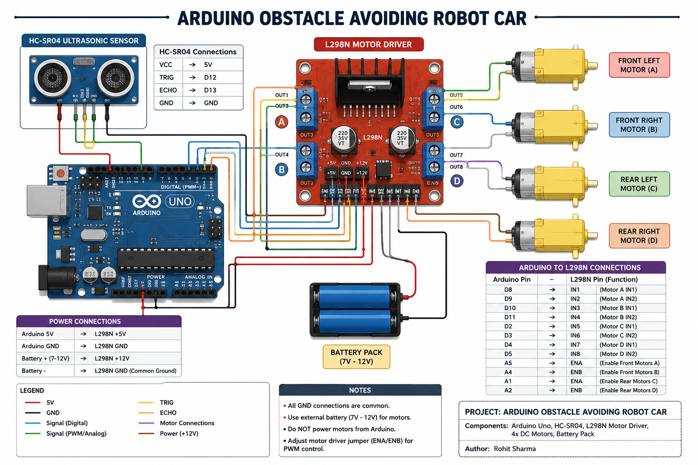

# 🔌 Circuit Diagram

This folder contains the wiring diagram for the Arduino Obstacle Avoiding Robot Car.

## Components

- Arduino Uno
- HC-SR04 Ultrasonic Sensor
- L298N Motor Driver
- 4 DC Motors
- Battery Pack (7V–12V)

## Circuit Diagram

## Notes

- Use a common GND between the Arduino, L298N motor driver, and battery.
- Connect the HC-SR04 Trigger pin to Arduino D12.
- Connect the HC-SR04 Echo pin to Arduino D13.
- Supply the motors using an external battery pack (7V–12V).
- Do not power the motors directly from the Arduino.
