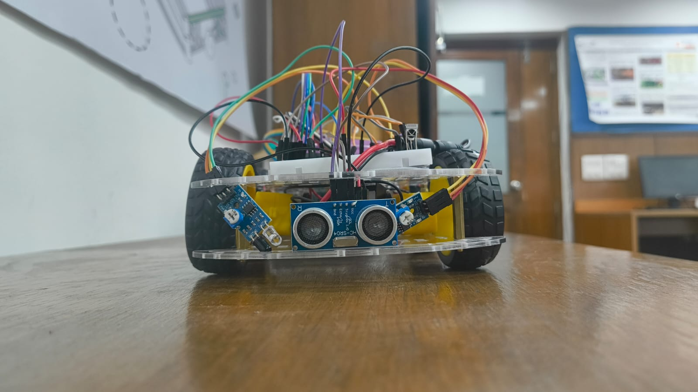
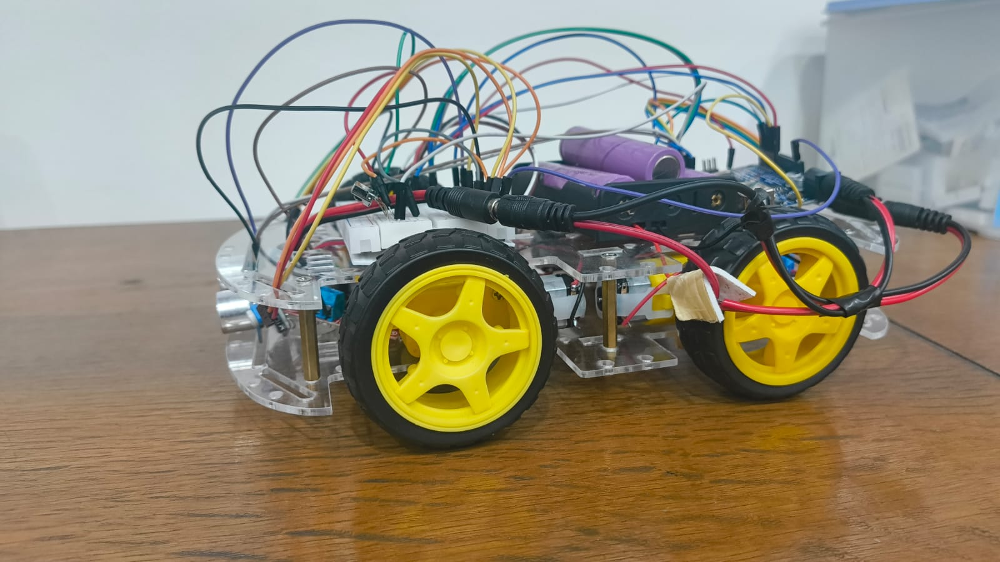
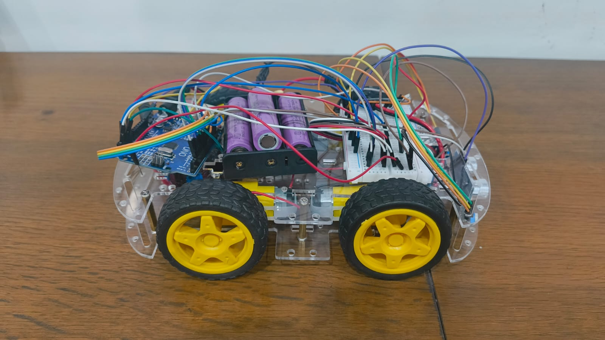
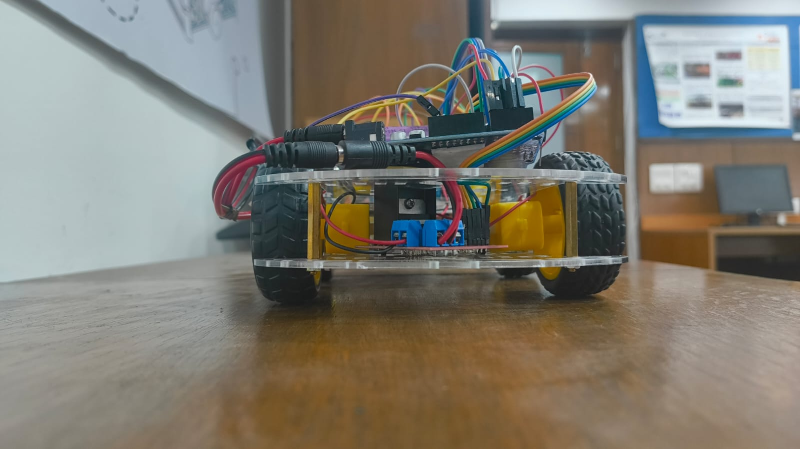

# 🚗 Arduino Obstacle Avoiding Robot Car

An autonomous obstacle avoiding robot car built using **Arduino Uno**, **HC-SR04 Ultrasonic Sensor**, **L298N Motor Driver**, and **Embedded C**.

The robot continuously measures the distance to obstacles using an HC-SR04 ultrasonic sensor. When an object is detected within a predefined threshold (50 cm), it stops, attempts a right turn, checks the path again, and if still blocked, performs a left turn before continuing autonomous navigation.

---

## 📸 Project Images

### Front View



### Left View



### Right View



### Back View



---

## 🎥 Demo Video

The demo video is available here:

[▶ Demo Video](Videos/Demo_video.mp4)

---

# ✨ Features

- Autonomous obstacle detection
- Automatic obstacle avoidance
- Four-wheel drive robot
- Real-time distance measurement
- Battery-powered operation
- Built using Arduino Uno
- Embedded C programming

---

# 🛠 Components Used

| Component | Quantity |
|-----------|----------|
| Arduino Uno | 1 |
| HC-SR04 Ultrasonic Sensor | 1 |
| L298N Motor Driver | 1 |
| DC Motors | 4 |
| Wheels | 4 |
| Robot Chassis | 1 |
| Battery Pack | 1 |
| Jumper Wires | Multiple |

---

# 💻 Software Used

- Arduino IDE
- Embedded C / Arduino Programming Language

---

# ⚙️ Working Principle

1. The robot continuously moves forward.
2. The ultrasonic sensor measures the distance to nearby obstacles.
3. If an obstacle is detected within 50 cm:
   - Stop
   - Turn right
   - Check again
   - If still blocked, turn left
4. Continue moving forward.
5. Repeat continuously.

---

# 🔌 Pin Connections

| Arduino Pin | Connected To |
|-------------|--------------|
| D8 | Motor Driver IN1 |
| D9 | Motor Driver IN2 |
| D10 | Motor Driver IN3 |
| D11 | Motor Driver IN4 |
| D2 | Motor Driver IN5 |
| D3 | Motor Driver IN6 |
| D4 | Motor Driver IN7 |
| D5 | Motor Driver IN8 |
| A5 | ENA Front |
| A4 | ENB Front |
| A1 | ENA Back |
| A2 | ENB Back |
| D12 | HC-SR04 Trigger |
| D13 | HC-SR04 Echo |

---

# 📁 Project Structure

```
Arduino-Obstacle-Avoiding-Robot-Car
│
├── Arduino_Code
├── Images
├── Videos
├── README.md
└── LICENSE
```

---

# 🚀 Future Improvements

- Servo-mounted ultrasonic sensor
- Bluetooth control
- Mobile application control
- ESP32 Wi-Fi control
- Camera module integration
- AI object detection

---

# 👨‍💻 Author

**Rohit Sharma**

B.Tech Computer Science Engineering

IIIT Delhi
